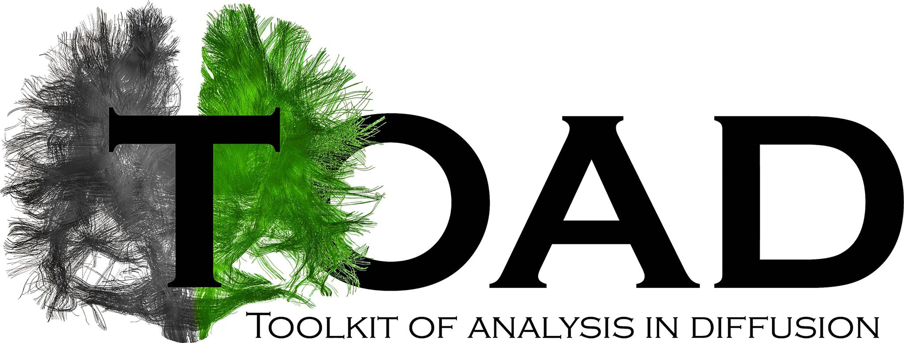

# TOolkit of Analysis in Diffusion imaging (TOAD)

Welcome to the English version of the documentation of [TOAD](http://unf-montreal.ca/toad/).
Sources files as well as installation’s instructions are available on [Github](https://github.com/UNFmontreal/toad).

TOAD offers a pipeline to automatically preprocess diffusion imaging data (DWI/DTI).
The different steps allow to:

1. Clean the data
2. Prepare the different masks to be used (white matter, grey matter...)
3. Extract the main tracts
4. Extract the main metrics (FA, MD...)

**Please, read the [*License agreement*](about/license.md) section to know which conditions you are supposed to meet to use TOAD!**

This website will guide you to start using TOAD [(tutorial)](tuto/01-requirements.md) and also includes a comprehensive documentation about each step followed by TOAD.

The tutorial is also available as a PDF file:

- [Tutorial (in english)](../../Toad_Tuto_en.pdf)
- [Tutorial (in french)](../../Toad_Tuto_fr.pdf)

We also recommend to **visit [this page](tuto/00-refs.md)** to better understand which analyses are used in TOAD.

## The team

 **Julien Doyon**:  scientific director of the [UNF (Unité de Neuroimagerie Fonctionnelle)](www.unf-montreal.ca)

 **Simona Brambati**: researcher and co-scientific leader of the project

 **Arnaud Boré**: developer and co-scientific leader of the project

 **Mathieu Desrosiers**: main developer and maintainer of the project

 **Christophe Bedetti**: developer and leader of the quality assessment of the project 

  **Guillaume Vallet**: in charge of the documentation and of the website

 **Jeni Chen**: translation and documentation of the project

 **Basile Pinsard**: developer and scientific advisor

 **Alexandru Hanganu**: scientific advisor

## Word from our director

[To come]

## Contact

You can contact us directly by email at: [**toadunf.criugm@gmail.com**](toadunf.criugm@gmail.com).

**For any question**, please add in the *object of your email* the name of the task or the name of section in TOAD in brackets followed by your question, as `[denoising] how to change the algorithm?` or `[website] missing information`.
