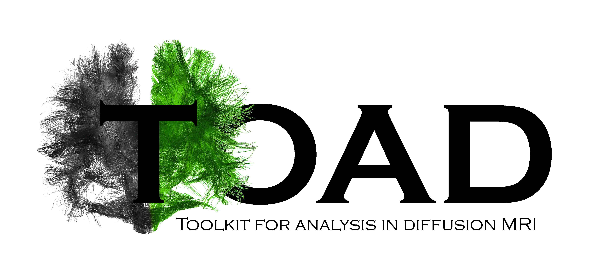
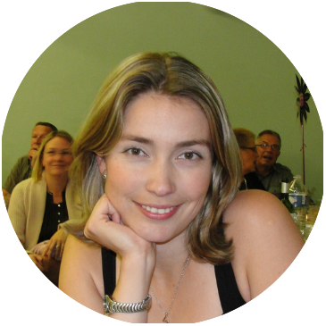

# TOolkit for Analysis in Diffusion MRI (TOAD)

Welcome to the English version of [TOAD](http://unf-montreal.ca/toad/) documentation.
Source files as well as installation instructions are available on [Github](https://github.com/UNFmontreal/toad).

TOAD offers an automated pipeline to preprocess diffusion imaging data (DWI/DTI) via various steps:

1. Data cleaning
2. Creation of white and grey matter mask
3. Extraction of the main tracts
4. Extraction of the main metrics (FA, MD...)

**Please take a moment to read the [*User agreement*](about/license.md) to understand the terms and conditions you are agreeing by using TOAD!**

This website provides a quick-start tutorial to run TOAD [(tutorial)](tuto/01-requirements.md) as well as a detailled documentation on each step.

The tutorial is also available in PDF file:

- [Tutorial (in English)](../../Toad_Tuto_en.pdf)
- [Tutorial (in French)](../../Toad_Tuto_fr.pdf)

We also recommend **visiting [this page](tuto/00-refs.md)** to help you better understand the techniques and analysis methods implemented in TOAD.

## The team

 **Julien Doyon**:  scientific director of the [UNF (Unité de Neuroimagerie Fonctionnelle)](www.unf-montreal.ca)

 **Simona Brambati**: researcher and co-scientific leader of the project

 **Arnaud Boré**: developer and co-scientific leader of the project

 **Christophe Bedetti**: developer and leader of the quality assessment of the project 

 **Jeni Chen**: translation and documentation of the project

 **Basile Pinsard**: developer and scientific advisor

 **Kristina Aurousseau** : translation, documentation of the project and manage google group TOAD

## Previous collaborators

  **Guillaume Vallet**: in charge of the documentation and of the website

 **Mathieu Desrosiers**: developer

 **Alexandru Hanganu**: scientific advisor

## Word from our director

Today, in-vivo diffusion weighted imaging has become the method of choice for clinicians and researchers in neuroscience interested in exploring the structural connectivity of the brain and spinal cord. Yet, analysis of the data acquired using this magnetic resonance imaging technique still remains complex and non-standardized. Resulting from an exceptional team work, the present platform named "Toolkit for Analysis of Diffusion MRI (TOAD)" provides novice and experts a range of user-friendly tools that allow to verify and visualize, step-by-step, the results obtained following image pre-processing and statistical analyses of various anisotropy and tractography metrics.  

As Scientific Director of the Functional Neuroimaging Unit (UNF) affiliated to the “Centre de recherche de l’Institut universitaire de gériatrie de Montréal” it is with pride that I thank the entire team of research professionals, students and researchers who, together, created TOAD. I sincerely believe that this pipeline will not only be useful to clinicians, but also to the scientific community in Quebec, Canada and around the world.

Julien Doyon, Ph.D.
Scientific Director
Functional Neuroimaging Unit

Director
Quebec Bio-Imaging Network

## Introduction to TOAD (slides)

<iframe src="http://slides.com/toadunfcriugm/deck-2/embed" width="576" height="420" scrolling="no" frameborder="0" webkitallowfullscreen mozallowfullscreen allowfullscreen></iframe>

## Contact

You can contact us directly by email at: [**toadunf.criugm@gmail.com**](toadunf.criugm@gmail.com).

**For any question**, please include in the subject line of email, the name of the task or the name of section in TOAD in brackets followed by your question, for example `[denoising] how to change the algorithm?` or `[website] missing information`.
