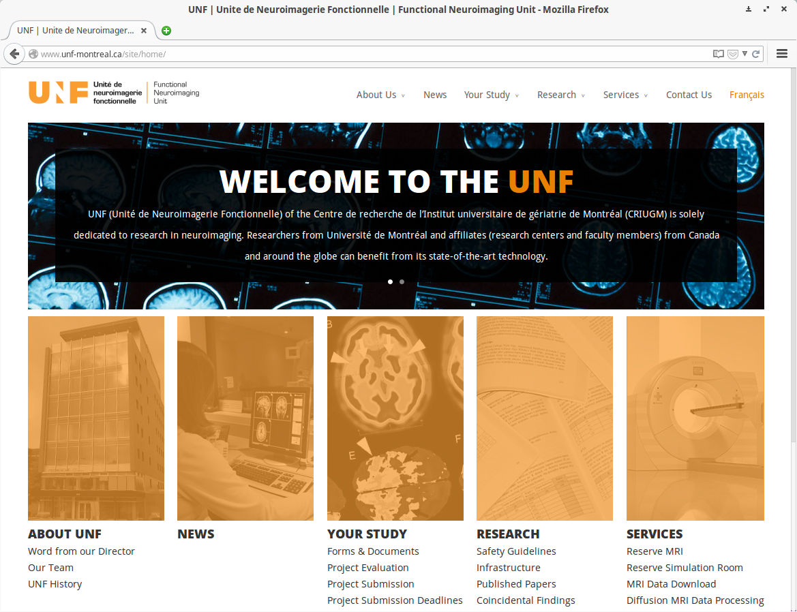
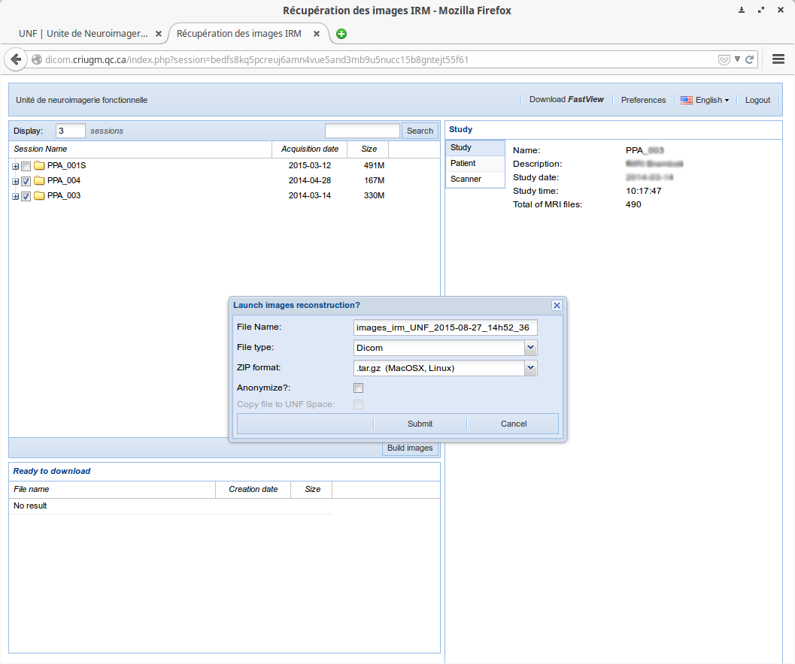
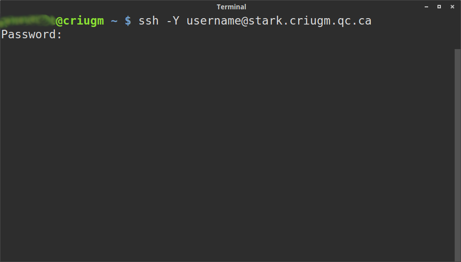
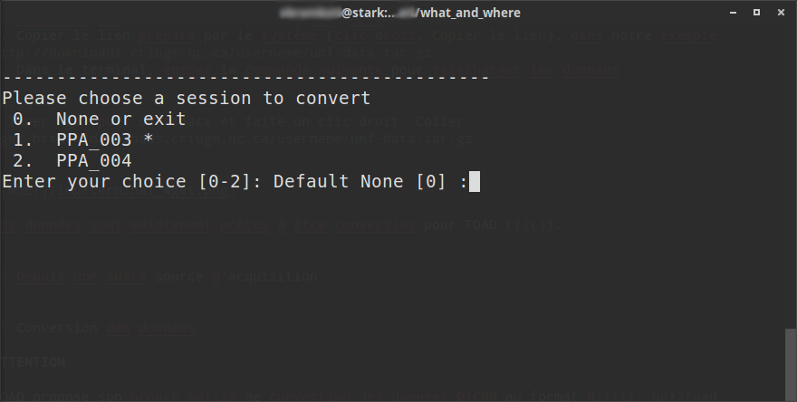

# Data retrieval and preparation 

## From the UNF web interface
The easiest and most practical way to retrieve data acquired at the UNF is to use the platform available at the UNF website. This platform takes care of all that is necessary to prepare and reconstruct the images from the scanner into Dicom format to be ready for download. To access the site: either from **the website of the [Neuroimaging unit](http://www.unf-montreal.ca)** (Menu `Services` then `MRI Data Download`), or directly from ** [the platform of the unit](https://unf-montreal.ca)**

### Data preparation

1. Before you can download the data, you need to reconstruct them into Dicom format. To do so, go to the UNF data download website [https://unf-montreal.ca](https://unf-montreal.ca)
2. Enter your user ID and password at the UNF
3. Select the data you want to download and click on `Build images` (keep the default option `tar.gz` for image compression type. TOAD will only work with this type)
4. Give a name to the dataset to be downloaded (in our example, `unf-data`), and click on `submit`

Data will be ready for download after a few moments.
**Do not close** your browser window; we will come back to it later.

### Data download

In the meantime, open a terminal window and connect to one of the UNF servers (Magma or Stark) via ssh.

~~~bash
# Replace 'username' by your user ID at the UNF
ssh -Y username@stark.criugm.qc.ca
~~~ 
 
The server will ask for your login information 

Once connected, navigate to your data directory:

~~~bash
# Replace `labname` by the name of the lab/group you belong to, and `username` by your user ID at the UNF
cd /data/labname/username/
~~~

If necessary, create a new folder for your project and go to this directory:

~~~bash
# Replace 'project_name' by the name of the folder your are naming
mkdir project_name

# To go to the new folder
cd project_name
~~~

Download the data prepared by the UNF platform:

1. Go back to the browser window where you are downloading your data.
2. If your data is ready for download (after clicking the `build images` button), you will see a link (in blue) with the name you had specified earlier (`unf-data.tar.gz` in our example) under the section `Ready to download`, located on the left corner of the window. The link will be available for 7 days.
Copy the link address by right-clicking on the link-> **`Copy link location`**, in our example, it would be `http://downloads.criugm.qc.ca/username/unf-data.tar.gz`
3. Go back to the previous terminal with the ssh session, and type the command `wget`, followed by pasting the link address:

~~~bash
# Type wget, followed by space, then right-click, choose `Paste`, or control-shift-v
wget http://downloads.criugm.qc.ca/username/unf-data.tar.gz
~~~

Your data are now being downloaded and will be ready to be converted by TOAD into its required format. ([see section '3 Data Conversion'](#conversion)).

### Data conversion
**ATTENTION**
TOAD uses its own file conversion tool `unf2toad` to convert DICOM images into NIfTI.
It is **strongly recommended** to use this tool for file conversion, because not only can it convert your data, it also generates a configuration file for TOAD. 
This file contains all existing information that are unique in the raw data which are lost upon conversion when using other softwares.

`unf2toad` automatically unzips and converts your data. 
Different options are available (see help by typing `unf2tad -h`), 
By default, `unf2toad` creates a new directory called `toad_data` where it stores all the converted files from each subject/session.

~~~bash
# Replace 'unf-data.tar.gz' by the name of your data (downloaded from the UNF site)
unf2toad unf-data.tar.gz

# To specify a target directory into which the converted files are written, for example `DWI`
unf2toad -d DWI unf-data.tar.gz
~~~

The software will ask you a series of questions to specify which file corresponds to which type of image (anatomical, diffusion, etc.), and to indicate the study/project ID. 

One of the strong features of `unf2toad` is its ability to manage multiple sessions/subjects simultaneously. It will first show you a list of sessions/subjects found within the downloaded data set. Subject ID followed by an asterisk * indicates the data from that subject have been converted. 

When multiple sessions/subjects share the exact same data structure, `unf2toad` offers the option of applying the setting options chosen for the first subject to the subsequent sessions/subjects.

<!-- FIXME Add screenshot identical type -->

## From another source of acquisition 

### Data type

The analysis of diffusion data requires at least 3 types of images from each subject: 

1. **anatomical images** (T1, type MPRAGE) : anatomical mask creation, coregistration
2. **diffusion images** (DWI) : white matter tracts (fibre extraction)
3. **acquisition specifications for the diffusion images (the `b-files`):** specifications for the acquisition of diffusion data (intensity and directions) regrouped in one (*.b) or 2 (*.bval and *.bvec) files.

Other kinds of data that can also be preprocessed in TOAD:

- **Eddy current** (Eddy Correction): Anterior-posterior and/or posterior-anterior gradient files
- **field inhomogeneity** (fieldmap): ... [FIXME]

### File format

For simplicity`s sake, TOAD only accepts the following file formats:

- neuroimaging: **NIfTI** (.nii) 
- encoding:  regrouped format **MRTRIX (.b)** or separated by values and vectors **(.val and .vec)**.

### Data organization

If you have data that are already converted into NIfTI as well as the encoding files, you can directly bypass the TOAD data conversion step. We recommend regrouping your data in the following manner:

- a parent folder containing all the files from your subjects
- individual subject folder containing all the imaging files (\*.nii, \*.b)

<pre>
    PROJET  
    |- SUJ1  
        |- anat_subj_.nii  
        |- dwi_subj_.nii  
        |- b0_subj_.b  
    |- SUJ2  
    |- SUJ3  
    |- ...  
</pre>
    
***Attention:*** *in this case, it is your responsibility to ensure that all your files have been correctly converted, and that the encoding file complies with the usual standards (strides ...).
If these data come from a Siemens scanner (as at the UNF), and if you still have the raw data, we strongly recommend to convert the data with the software `unf2toad` [see section Data conversion](# conversion)

### File naming
TOAD needs to identify which files correspond to which image. 
To do so, TOAD uses the prefix that is common to the file name of each type of files. Similarly, all the anatomical images should start by the same prefix; by default TOAD looks for files that start with `anat`.
For diffusion images, TOAD looks for files that start with `dwi` and for the encoding files, `b0`.
When the anterior-posterior or posterior-anterior files are available, TOAD looks for the prefix `b0_ap` and `b0_pa`.

You are free to use any current naming system, as long as it is specified in your configuration file `config.cfg`.
It must be consistent across all subjects, unless you specify a new configuration file in the folder

## Sample data set and demonstration

We suggest you to download a sample dataset to discover how the pipeline works by following these steps:

~~~bash
# Connect to the UNF server
# Replace 'username' by your user ID at the UNF
ssh -Y username@stark.criugm.qc.ca

# Navigate to your data directory
# Replace `labname` by the name of the lab/group you belong to, and `username` by your user ID at the UNF
cd /data/labname/username/

# Create a folder for your project
# Replace 'project_name' by the name of the project
mkdir project_name

# Go into the new folder
cd project_name

# Download the sample data set
wget http://unf-montreal.ca/downloads/toad_dicom.tar.gz
~~~
