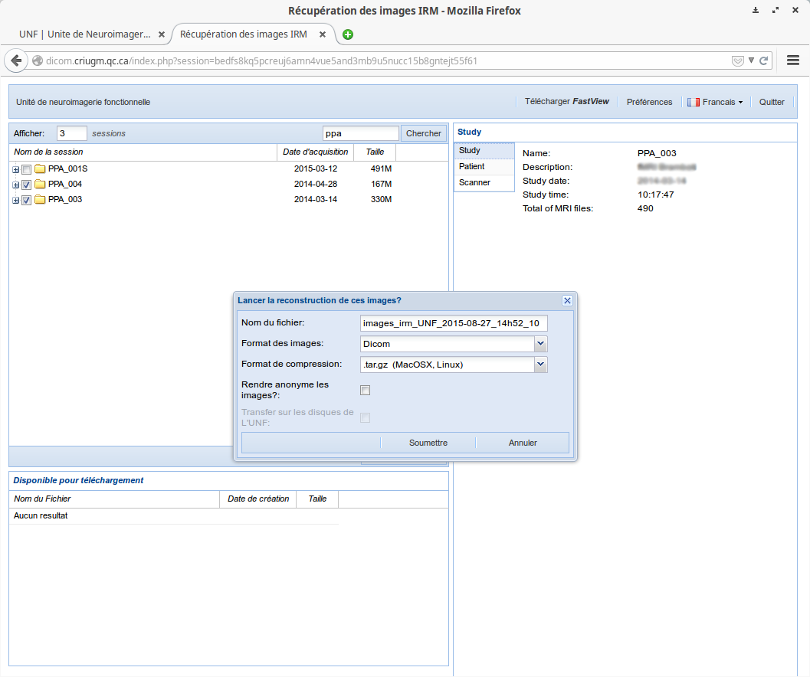
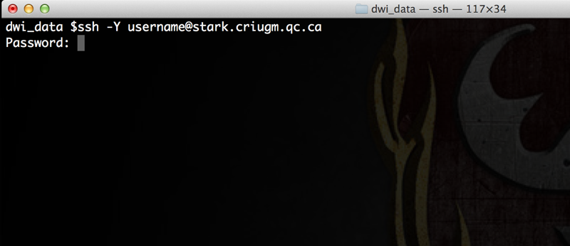
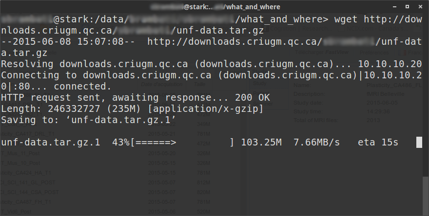
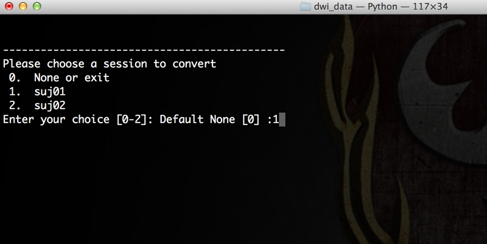

# Récupération et préparation des données de neuroimagerie

## Depuis la plateforme de l’UNF

La solution la plus simple et pratique pour la récupération des données de neuroimagerie acquises à l’UNF est d’utiliser la plateforme mise à disposition sur le site internet de l’unité.
Cette plateforme s’occupe de la préparation des données et de leur compression pour un téléchargement et partage simplifié.
Elle est accessible soit depuis **le site internet de l‘[unité de neuroimagerie](http://www.unf-montreal.ca)** (Menu `Services` puis `Récupération des données IRM`), soit directement depuis **la [plateforme de l’unité](https://unf-montreal.ca)**

### Préparation des données

1. Connectez-vous à [https://unf-montreal.ca](https://unf-montreal.ca)
2. Entrer votre identifiant et mot de passe de votre compte UNF
3. Sélectionner les données à récupérer et cliquer sur `Préparer les images` (garder le choix par défaut pour la compression des images `tar.gz`)
4. Donner un nom à l’archive à télécharger, pour notre exemple `unf-data` et cliquer sur `Soumettre`

Les données seront prêtes à télécharger après quelques instants.
**Ne fermer pas** votre fenêtre de navigation, nous y reviendrons après.

### Téléchargement des données

Pendant ce temps, ouvrez un terminal sur votre ordinateur et connectez-vous en ssh à un des serveurs de l’UNF (Magma ou Stark).

~~~bash
# Remplacer 'username' par votre identifiant de votre compte UNF
ssh -Y username@stark.criugm.qc.ca
~~~ 

Le serveur vous demandera alors le mot de passe de votre compte UNF.

Une fois connecté, naviguer dans votre répertoire de données :

~~~bash
# Remplacer 'labname' par le nom du laboratoire 
# Remplacer 'username' par l’identifiant de votre compte UNF
cd /data/labname/username/
~~~

Au besoin, créez un nouveau répertoire pour votre projet et déplacez-vous dans ce répertoire :

~~~bash
# Remplacer 'project_name' par le nom du projet
mkdir project_name

# Aller dans le nouveau répertoire
cd project_name
~~~

Télécharger les données préparées par l’UNF :

1. Retourner sur la page internet du site internet de l’UNF (si vous avez fermé votre navigateur, le lien est disponible pendant 7 jours dans la section `Services/Récupération des données IRM`)
2. Dans l’encadré en bas à gauche de la fenêtre, vous trouverez le lien (en bleu) des données préparées (le nom donné auparavant, comme 'unf-data.tar.gz'). **Copier le lien préparé par le système (clic droit, `Copier le lien`/`Copy link location`)**, dans notre exemple `http://downloads.criugm.qc.ca/username/unf-data.tar.gz`
3. Dans le terminal, entrer la commande suivante pour télécharger les données

~~~bash
# Taper wget puis un espace et faite un clic droit `Coller` ou control-shift-v
wget http://downloads.criugm.qc.ca/username/unf-data.tar.gz
~~~

Vos données sont maintenant prêtes à être converties pour TOAD ([voir section '3 Conversion des données'](#conversion)).

### Conversion des données

**ATTENTION**

TOAD propose son propre outil de conversion des données DICOM au format NIfTI, `unf2toad`. 
Il est **très vivement recommandé** de l’utiliser, car cet outil permet *non seulement* de convertir vos données, mais *également* de préparer un fichier de configuration pour TOAD.
Ce fichier tient compte d’informations existantes uniquement dans les données brutes et qui seront perdues par tout autre logiciel de conversion !

La décompression et la conversion des données sont automatiquement effectuées par `unf2toad`.
Différentes options sont possibles (voir l’aide `unf2toad -h`), dont la possibilité de spécifier le nom du répertoire dans lequel ajouter les fichiers convertis. 
Par défaut, `unf2toad` crée un nouveau répertoire `toad_data` dans lequel il placera les sessions/sujets convertis.

~~~bash
# Remplacer 'unf-data.tar.gz' par le nom de votre archive
unf2toad unf-data.tar.gz

# Pour spécifier un répertoire cible, ici 'DWI'
unf2toad -d DWI unf-data.tar.gz
~~~

Le logiciel vous posera une série de questions pour préciser quel dossier correspond à quel type d’images (anatomique, diffusions, etc.), indiquer le code du participant, etc.

Une des forces d’`unf2toad` est de pouvoir gérer de multiples sessions/sujets à la fois. 
Ainsi, le logiciel vous indiquera tout d’abord une liste des sessions/sujets détectés au sein de l’archive.
Une `*` qui suit le code du sujet indique que le sujet a déjà été converti.

Lorsque plusieurs sessions/sujets partagent l’exacte même structure de données, `unf2toad` vous proposera d’appliquer à la chaine les choix faits pour le premier sujet de la série.

<!-- FIXME Add screenshot identical type -->

## Depuis une autre source d’acquisition 

### Type de données 

Les analyses de diffusion nécessitent la présence d’au moins trois types de données par participant :

1. **données anatomiques** (T1, type MPRAGE) : création des masques anatomiques, coregistration
2. **données de diffusion** (DWI) : faisceaux de matière blanche (extraction des fibres)
3. **acquisition des données de diffusion** (fichers b) : spécifications relatives à l’acquisition des données de diffusion (intensités et directions) regroupées en un seul fichier (*.b) ou en deux fichiers (*.bval et *.bvec)

D’autres données peuvent servir à TOAD pour le traitement des données :

- **courants de Foucault** (Eddy Correction) : fichiers des gradients antérieur-postérieur et/ou postérieur-antérieur
- **inhomogénéité du champ** (fieldmap) : ... [FIXME]

### Format des fichiers

Pour des raisons de simplicité, TOAD accepte seulement quelques formats :

- neuroimagerie : **format NIfTI** (.nii) 
- encodage :  format regroupé **MRTRIX (.b)** ou séparé en valeurs et vecteurs **(.val et .vec)**.

### Organisation des données

Si vous disposez de données déjà converties au format NIfTI ainsi que des fichiers d’encodage, vous pouvez utiliser TOAD sans passer par la conversion au préalable.
Nous vous recommandons de regrouper les données de la façon suivante :

- un dossier parent contenant tous les dossiers participants
- chaque dossier participant contenant tous les fichiers de neuroimagerie (\*.nii, \*.b) 

<pre>
    PROJET  
    |- SUJ1  
        |- anat_subj_.nii  
        |- dwi_subj_.nii  
        |- b0_subj_.b  
    |- SUJ2  
    |- SUJ3  
    |- ...  
</pre>
    
***Attention :*** *dans ce cas de figure, il est de votre responsabilité de vous assurer les données ont été correctement converties et que le fichier d’encodage respecte bien les normes habituelles (strides...). 
Si ces données proviennent d’un scanner Siemens (comme à l’UNF), et si vous disposez encore des données brutes, nous recommandons fortement de reconvertir les données avec le logiciel `unf2toad` [voir section Conversion des données](#conversion)

### Nomemclature des fichiers

TOAD doit identifier quels fichiers correspondent à quels types d’images. 
Pour ce faire, TOAD se base sur des préfixes des noms des fichiers qui doivent être communs pour chaque type de fichiers.
Ainsi, toutes les images anatomiques devront commencer par un même préfixe, par défaut TOAD cherchera des fichiers commençant par `anat`.
Pour les images de diffusion, TOAD cherchera des fichiers commençant par `dwi` et pour l’encodage à `b0`. 
Lorsque les données antérieur/postérieur ou postérieur/antérieur sont disponibles, TOAD cherchera comme préfixe `b0_ap` et `b0_pa`.

Vous êtes libre d’utiliser n’importe quelle nomenclature du moment qu’elle soit indiquée dans le fichier de configuration `config.cfg`. 
Cette nomenclature devra être constante à travers les sujets à moins de spécifier un nouveau fichier de configuration au sein du dossier du participant en question.

## Jeu de données de démonstration

TOAD vous propose de télécharger un jeu de données limité pour découvrir comment fonctionne le pipeline.
Suiver les étapes suivantes pour le récupérer :

~~~bash
# Connexion aux serveurs de l‘UNF
# Remplacer 'username' par votre identifiant UNF
ssh -Y username@stark.criugm.qc.ca

# Naviguer dans votre répertoire de données
# Remplacer 'labname' par le nom du laboratoire 
# Remplacer 'username' par l’identifiant de votre compte UNF
cd /data/labname/username/

# Créer un dossier pour le projet 
# Remplacer 'project_name' par le nom du projet
mkdir project_name

# Aller dans le nouveau répertoire
cd project_name

# Técharger le jeu de données
wget http://unf-montreal.ca/downloads/toad_dicom.tar.gz
~~~
